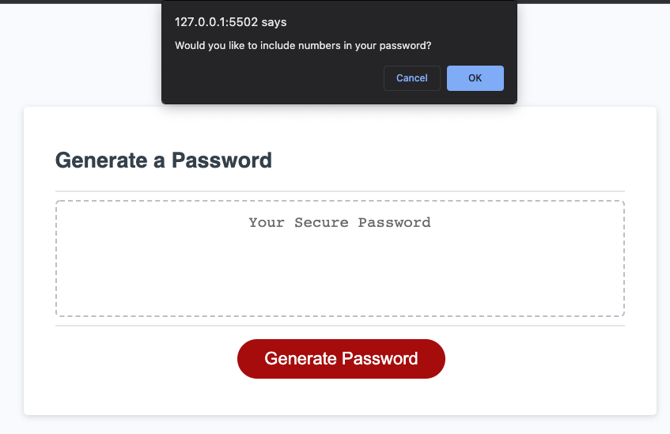

# Password Generator

## Description

- I have been tasked to modify starter code to create an application that enables employees to generate random passwords based on criteria that they’ve selected.

## Acceptance Criteria - Checklist

- When the 'Generate Password' button is clicked a prompt appears asking the user to select a password length between 8-128 characters.

- Once the user has input an integer between 8-128 the prompts cycle through the criteria asking the user if they would like lowercase, uppercase, numbers and special characters in their password.

- If the user enters an integer that is not between 8-128 they will be presented with a prompt alerting them, it will return a false and the criteria prompts will not show.

- 'Else' statment in place as part of error handling if user selects a length but does not select a true option for any of the letter, symbols and number criteria.

- Dependent on the users input a password will successfully generate in accordance to the selections made by the user.

---

## Screenshot of deployed application

Password length alert.

Lowercase characters alert.

Uppercase characters alert.

Numbers alert.

Special characters alert.

Error handling - 'please choose atleast one type of character' alert.

Error handling - password length criteria not met alert.

Deployed Application showcasing password.

---

## The URL of the deployed application

https://riz1ash786.github.io/week3-password-generator/

## The URL of the GitHub repository

https://github.com/riz1ash786/week3-password-generator
